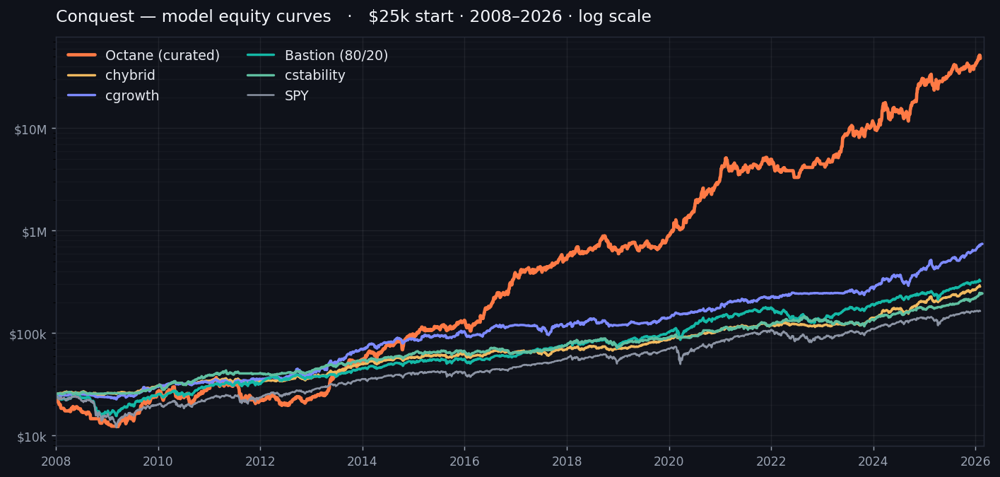

# Conquest

> *"Forecasts may tell you a great deal about the forecaster; they tell you nothing about the future."* — Warren Buffett

Conquest is a personal systematic trading system built on [QuantConnect Lean](https://www.lean.io/). It doesn't forecast — it reacts to what markets are doing *today* (volatility, momentum, credit spreads, the macro regime) and applies pre-committed, rule-based allocations. Long-only, no margin, no option selling.



*Point-in-time backtests · $25k start · 2008–2026 · log scale — illustrative, not a forecast. Octane's curated curve is hindsight-inflated (see the note under the table below).*

> 🔒 **Source availability — some of the code is intentionally hidden.** This repository publishes the full **framework** and the three models it's built around — **`cstability`**, **`cgrowth`**, and **`chybrid`**. Other strategies (the live flagship **`octane`**, and the retired **`surge`** / **`ctactical`**) are proprietary and **not included**; they appear in the table below for context only.

---

## What's in this repository

- **`conquest/`** — the shared library: point-in-time data adapters (ALFRED/FRED/BLS), a macro-regime classifier, volatility + indicator utilities, a backtest engine with overfit-deflated metrics (Deflated / Probabilistic Sharpe), signal helpers, and a research "model zoo" of strategy variants.
- **Three full model implementations** — `cstability` (defensive ETF rotator), `cgrowth` (S&P 500 momentum), `chybrid` (combined multi-asset fund).
- **`scripts/`** — the data-refresh pipeline (signals → Object Store) and supporting tooling.
- **Not included:** the live flagship **`octane`** (source, stock universe, and parameters withheld) and the retired **`surge`** / **`ctactical`** strategies — all proprietary.

---

## Philosophy

- **Adapts daily, predicts never.** Rules like *"if volatility spikes and the market's recent trend turns negative, move to cash"* — reactions to what *is* happening, not guesses about what's coming.
- **Designed to survive the worst.** The bad case (a deep drawdown) shouldn't end the game; the good case (steady compounding) does the heavy lifting over a decade-plus horizon.
- **Validated out-of-sample, not just in-sample.** Walk-forward on unseen windows; a strict-Pareto promotion rule that rejects the large majority of candidate changes; overfit-deflated metrics to check the edge isn't multiple-testing luck.
- **Honest about the future.** The 2008–2026 backtest era enjoyed unusual tailwinds; long-run expectations should mean-revert well below the in-sample numbers.

---

## The models

Figures are **point-in-time backtests over an ~18-year window (illustrative, not a forecast)**. The sleeves + Bastion ship with (or need) no hidden logic; the live flagship `octane` is listed for context only, with its source and stock universe withheld.

| Model | Source | What it does | CAGR | Max DD | PSR |
|---|---|---|---:|---:|---:|
| **cstability** | ✅ open | Defensive ETF rotator over a broad universe; a multi-signal risk-off ensemble drives a layered cash blend and volatility gate | ~13% | −21% | 24% |
| **cgrowth** | ✅ open | Top-5 large-cap equity momentum (momentum × low-volatility), with a sector cap, volatility gate, and a crisis-gate fed from cstability | ~20% | −33% | 33% |
| **chybrid** | ✅ open | Combined multi-asset fund: the growth + defensive sleeves plus a crypto chain, gold, and cash | ~17% | −13% | 78% |
| **Bastion** | ✅ trivial | Hands-off 80% Nasdaq-100 + 20% gold buy-hold — the survivable, tax-efficient core (a plain public allocation; there is no proprietary logic to publish) | ~15% | −42% | — |
| **octane** | 🔒 private · live | Aggressive, concentrated tech/AI single-stock momentum with a macro-tail crash gate; unlevered. Source, stock universe, and parameters withheld | ~52%¹ | −51% | 61% |
| *surge* | 🔒 private · retired | Aggressive leveraged-ETF momentum rotation with a volatility-spike overlay | ~45% | −46% | 26% |
| *ctactical* | 🔒 private · retired | Balanced blend of the growth + defensive sleeves with gold, a small crypto sleeve, and cash | ~22% | −20% | 72% |

¹ `octane`'s curated universe contains names chosen with hindsight, so its ~52% backtest **overstates the forward edge** — treat it as an optimistic upper bound (realistically lower, with a deep drawdown, if the AI thesis doesn't hold), not a forecast. Its source, universe, and parameters remain private.

---

## How it's built — the methodology

- **Point-in-time (PIT) data discipline.** Macro series are pulled from *vintage* snapshots and every signal is stamped with its **release date**, not its reference date — so a backtest only ever "knows" what was actually public at the time. Look-ahead is treated as a first-class correctness concern.
- **Strict-Pareto promotion gating.** A candidate is promoted only if it beats the incumbent on *every* backtest metric. The large majority of ideas fail this bar, and the rejections are recorded so they aren't retried.
- **Bias correction.** Returns are stress-tested for realistic slippage, intra-day drawdown, a proper risk-free Sharpe, and overfit deflation via the Deflated / Probabilistic Sharpe Ratio.
- **Rule-based first.** Linear, interpretable rules before any machine learning; ML is adopted only where it clearly and robustly beats the rule-based baseline.

A short retrospective of the hardest problems and how they were solved is in **[CHALLENGES.md](CHALLENGES.md)**.

---

## Repository layout

```
conquest/             Shared library (the framework)
  data/               Point-in-time data adapters (ALFRED / FRED / BLS)
  regime/             Macro-regime classifier
  vol/  indicators/   Volatility + indicator utilities
  backtest/           Backtest engine + metrics (deflated / probabilistic Sharpe)
  signals/  models/   Signal helpers + a research model zoo
  production/         Live-runtime support (alerts, freshness, state, attribution)
  tests/              pytest suite
cstability/  cgrowth/  chybrid/   Model algorithms (full source)
scripts/              Data-refresh pipeline + tooling
```

---

## Quick start

```bash
# Python 3.12 (conda env recommended)
pip install -e '.[test]'                 # quote the extras — zsh treats .[test] as a glob
pytest                                   # run the test suite

# Regenerate the signal pipeline (needs your own FRED/BLS API keys in the environment):
python scripts/refresh_data.py
python scripts/classify_regime.py
python scripts/compute_4vote_signal.py
```

The model algorithms are QuantConnect Lean projects: each reads its signals from the Lean Object Store and is backtested on QC's cloud. See each open model's `main.py` for the strategy logic and `config.json` for parameters.

---

## Disclaimer

This is a **personal research project** — Nothing here is an offer or solicitation. Backtested and simulated results have inherent limitations and **do not guarantee or predict future performance**; live results will differ. Leveraged and volatility-linked instruments can lose value rapidly. As noted above, the live `octane` strategy — its source, stock universe, and parameters — is proprietary and **not included**; nothing here is licensed for reuse.
